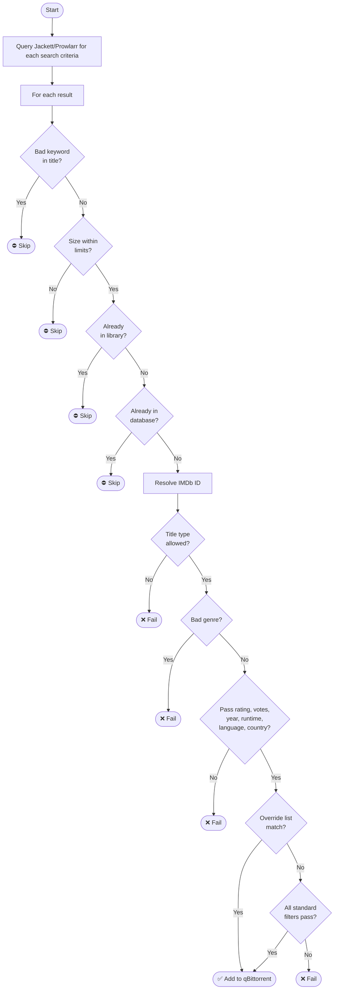

# movarr

Automated movie downloader based on IMDb criteria filtering.

## Features

- **Jackett and Prowlarr integration** — polls any Jackett-configured indexer (or all indexers at once) or a
  Prowlarr instance for movie torrents across configurable quality tiers (1080p, 2160p, 2160p remux, etc.).
- **Deep IMDb filtering** — every candidate is resolved to an IMDb ID and evaluated against rating, vote count,
  year, runtime, language, country, title type, and genre before anything is queued.
- **Override lists** — bypass the standard filters for specific directors, cast members, writers, movie titles, or
  characters (e.g. force-accept all James Bond films regardless of rating).
- **Genre threshold overrides** — relax rating and vote minimums on a per-genre basis (e.g. accept Animation
  titles at a lower rating floor than live-action).
- **Library deduplication** — resolves candidate titles to IMDb IDs and checks against all configured library
  paths before queuing, preventing duplicate downloads.
- **Database deduplication** — records every evaluated title in SQLite; previously passed, failed, or stalled
  titles are skipped on subsequent runs.
- **Configurable TTL expiry** — failed, stalled, and passed records are automatically pruned after configurable
  retention windows so titles can be re-evaluated over time.
- **Queue management** — monitors qBittorrent for torrents stuck in stalled or metadata-fetching states and
  removes them after configurable grace periods.
- **qBittorrent-aware queue management** — stalled torrent removal is paused when qBittorrent reports
  it is disconnected from the internet, preventing false positives from transient outages.
- **Post-processing** — detects completed downloads in qBittorrent, copies qualifying files to your media
  library, and removes source files if configured.
- **Genre/certification routing** — routes completed movies to different library paths per viewer profile based
  on genre and age-rating rules.
- **Notifications** — sends alerts via any [apprise](https://github.com/caronc/apprise)-compatible service
  (ntfy, Discord, Telegram, email, and more).
- **Three independent schedulers** — acquisition, queue management, and post-processing each run on their own
  configurable interval.
- **Daemon mode** — runs as a background process with PID file management, or in foreground mode for direct
  invocation.
- **Automatic config migration** — upgrades the YAML config schema automatically on startup, backing up the
  previous version before applying changes.

## Prerequisites

- [Python 3.12+](https://www.python.org/downloads/)
- [Astral uv](https://github.com/astral-sh/uv#installation) (optional)
- [Jackett](https://github.com/Jackett/Jackett) or [Prowlarr](https://github.com/Prowlarr/Prowlarr) — torrent indexer proxy
- [qBittorrent](https://www.qbittorrent.org/) with Web UI enabled

## Quick start

### Installation using uv (recommended)

```bash
git clone https://github.com/binhex/movarr
cd movarr
uv venv --quiet
uv sync
```

### Installation using pip

```bash
git clone https://github.com/binhex/movarr
cd movarr
python -m venv .venv
source .venv/bin/activate
pip install .
```

### Usage

```bash
movarr --help
```

## Options

All options are optional overrides. When an option is omitted, the value from `movarr.yml` is used.

### General

| Option | Description | Default |
| ------ | ----------- | ------- |
| `--config-path <dir>` | Directory containing `movarr.yml`. | `configs` |
| `--log-path <dir>` | Override the log directory from config. The file `movarr.log` is created inside. | *(from config)* |
| `--log-level <level>` | Override the console log level. Choices: `DEBUG`, `INFO`, `SUCCESS`, `WARNING`, `ERROR`. Useful for temporary debugging without editing the config file. | *(from config)* |
| `--db-path <dir>` | Override the database directory from config. The file `movarr.db` is created inside. | *(from config)* |
| `--library-path-list <path[,path...]>` | Comma-separated list of library root paths, overrides `general.library_path_list` in config. Example: `/media/movies,/media/4k`. | *(from config)* |
| `--daemon` | Run in background daemon mode. Without this flag movarr runs a single pass and exits. | `false` |
| `--test` | Validate configuration and exit without running any tasks. | `false` |
| `--version` | Print the version and exit. | — |

### qBittorrent

| Option | Description | Default |
| ------ | ----------- | ------- |
| `--qbt-host <host>` | Override qBittorrent WebUI host from config. | *(from config)* |
| `--qbt-port <port>` | Override qBittorrent WebUI port from config. | *(from config)* |
| `--qbt-username <user>` | Override qBittorrent username from config. | *(from config)* |
| `--qbt-password <pass>` | Override qBittorrent password from config. | *(from config)* |

### Index Proxy

| Option | Description | Default |
| ------ | ----------- | ------- |
| `--index-proxy <proxy>` | Override index proxy selection. Choices: `jackett`, `prowlarr`. | *(from config)* |
| `--jackett-host <host>` | Override Jackett host from config. | *(from config)* |
| `--jackett-port <port>` | Override Jackett port from config. | *(from config)* |
| `--jackett-api-key <key>` | Override Jackett API key from config. | *(from config)* |
| `--prowlarr-host <host>` | Override Prowlarr host from config. | *(from config)* |
| `--prowlarr-port <port>` | Override Prowlarr port from config. | *(from config)* |
| `--prowlarr-api-key <key>` | Override Prowlarr API key from config. | *(from config)* |

> **Unraid users:** map container environment variables directly to these flags so a working
> deployment requires no manual config file editing.

## Configuration

All behaviour is controlled by a YAML file inside the config directory (`configs/movarr.yml` by default). A default config is created
automatically on first run. The file is divided into the sections below.

### `general`

| Key | Description | Default |
| --- | ----------- | ------- |
| `config_version` | Schema version — managed automatically; do not edit. | *(current)* |
| `daemon_mode` | `foreground` or `background`. Overridden by `--daemon` CLI flag. | `foreground` |
| `log_level_console` | Console logging level (`debug`, `info`, `success`, `warning`, `error`). Overridden by `--log-level`. | `info` |
| `log_level_file` | File logging level. | `info` |
| `log_path` | Directory for the log file (`movarr.log` is created inside). Empty string disables file logging. Overridden by `--log-path`. | `"logs"` |
| `library_path_list` | Root paths to scan when checking whether a movie already exists in the library. Overridden by `--library-path-list`. | `[]` |
| `db_path` | Directory for the SQLite history database (`movarr.db` is created inside). Overridden by `--db-path`. | `"db"` |
| `pid_path` | Directory for the PID file (`movarr.pid` is created inside). Empty string disables PID file creation. Overridden by `--pid-path`. | `"pids"` |

### `schedule`

Each of the three background tasks has its own schedule block with the same keys:

| Key | Description | Default |
| --- | ----------- | ------- |
| `enabled` | Enable or disable this task. | `true` |
| `schedule_time_units` | Unit for the interval. Always `minutes`. | `minutes` |
| `schedule_time_mins` | Interval in minutes between runs. | `30` (acquisition), `5` (queue_management / post_processing) |
| `run_on_start` | Run this task immediately when movarr starts, before the first interval elapses. | `true` |

Tasks: `acquisition`, `queue_management`, `post_processing`.

### `filters`

Controls which torrents pass the IMDb quality gate.

| Key | Description | Default |
| --- | ----------- | ------- |
| `minimum_year` | Reject movies released before this year. | `1970` |
| `minimum_runtime_mins` | Reject movies shorter than this many minutes. | `60` |
| `minimum_rating` | Minimum IMDb rating (0–10). | `7.0` |
| `minimum_votes` | Minimum IMDb vote count. | `5000` |
| `override_genre` | Map of genre → `{minimum_rating, minimum_votes}` to relax thresholds for specific genres. | `{}` |
| `allow_imdb_title_type_list` | Allowed IMDb title types. | `[movie, video, tvmovie]` |
| `allow_country_list` | Allowed production country codes (ISO 3166-1 alpha-2). Empty = allow all. | `[]` |
| `allow_language_list` | Allowed spoken language codes (ISO 639-1). Empty = allow all. | `[]` |
| `reject_index_title_list` | Index titles containing any of these keywords (case-insensitive) are rejected before IMDb lookup. | *(see default config)* |
| `reject_genre_list` | Reject any movie whose IMDb genres include one of these values. | `[]` |
| `reject_genre_exclusive_list` | Reject a movie only when ALL of its IMDb genres are in this list (e.g. add `Horror` to reject pure horror, keep horror/sci-fi hybrids). | `[]` |
| `reject_movie_title_list` | Reject movies whose resolved title exactly matches any entry. | `[]` |
| `reject_index_group_list` | Reject torrents from these release groups (case-insensitive). | `[]` |
| `override_cast_list` | Force-accept any movie featuring one of these cast members, bypassing all other filters. | `[]` |
| `override_writer_list` | Force-accept any movie written by one of these writers. | `[]` |
| `override_director_list` | Force-accept any movie directed by one of these directors. | `[]` |
| `override_movie_title_list` | Force-accept any movie whose title contains one of these strings. | `[]` |
| `override_character_list` | Force-accept any movie featuring one of these characters. | `[]` |
| `preferred_index_quality_list` | Keywords indicating a preferred quality edition (e.g. `remastered`, `directors cut`). Matching torrents sort higher. | `[]` |
| `preferred_index_group_list` | Preferred release group names. Matching torrents sort higher. | `[]` |

### `torrent_client`

| Key | Description | Default |
| --- | ----------- | ------- |
| `selected` | Torrent client to use. Currently only `qbittorrent` is supported. | `qbittorrent` |
| `qbittorrent.host` | qBittorrent Web UI hostname or IP address. | `localhost` |
| `qbittorrent.port` | qBittorrent Web UI port. | `8080` |
| `qbittorrent.username` | Web UI username. | `admin` |
| `qbittorrent.password` | Web UI password. | `adminadmin` |
| `qbittorrent.add_paused` | Add torrents in paused state. | `false` |
| `qbittorrent.category` | Category tag applied to all movarr-managed torrents. | `movies-movarr` |

### `notification`

| Key | Description | Default |
| --- | ----------- | ------- |
| `apprise_urls` | List of [apprise](https://github.com/caronc/apprise) service URLs. Leave empty to disable. | `[]` |
| `index_proxy_alert_hours` | Send an alert if the index proxy returns no results or is unreachable for this many consecutive hours. Set to `0` to disable. | `0` |
| `torrent_client_alert_hours` | Send an alert if the torrent client has been unreachable for this many consecutive hours. Set to `0` to disable. | `0` |

Apprise supports ntfy, Discord, Telegram, email, Slack, and many other services. Example:
`ntfy://my-topic`, `discord://webhook-id/webhook-token`.

### `index_proxy`

| Key | Description | Default |
| --- | ----------- | ------- |
| `selected` | Index proxy to use: `jackett` or `prowlarr`. | `jackett` |
| `jackett.host` | Jackett hostname or IP address. | `localhost` |
| `jackett.port` | Jackett port. | `9117` |
| `jackett.api_key` | Jackett API key (found in the Jackett dashboard). | `""` |
| `jackett.read_timeout` | HTTP read timeout in seconds. | `60.0` |
| `jackett.limit` | Maximum number of results to request per search query. | `500` |
| `jackett.offset` | Result offset for pagination. | `0` |
| `jackett.ignore_list` | Jackett indexer names to skip when querying with `jackett_indexer: all`. Case-insensitive. | `[]` |
| `prowlarr.host` | Prowlarr hostname or IP address. | `localhost` |
| `prowlarr.port` | Prowlarr port. | `9696` |
| `prowlarr.api_key` | Prowlarr API key (found in *Settings → General*). | `""` |
| `prowlarr.read_timeout` | HTTP read timeout in seconds. | `60.0` |
| `prowlarr.ignore_list` | Prowlarr indexer names to skip when querying with `prowlarr_indexer: all`. Case-insensitive. | `[]` |

### `credentials`

| Key | Description | Default |
| --- | ----------- | ------- |
| `tmdb.api_key` | [TMDb](https://www.themoviedb.org/settings/api) API key (IMDb ID resolution fallback). | `""` |
| `omdb.api_key` | [OMDb](https://www.omdbapi.com/apikey.aspx) API key (IMDb ID resolution fallback). | `""` |

### `index_site`

Controls what is searched and which indexers are used.

| Key | Description | Default |
| --- | ----------- | ------- |
| `jackett_indexer` | Jackett indexer to query. Use `all` to query every configured indexer simultaneously. | `all` |
| `prowlarr_indexer` | Prowlarr indexer ID to query. Use `all` (maps to `-1`) or a numeric indexer ID from Prowlarr. | `all` |
| `search` | List of search criteria blocks (see below). | *(1080p only)* |
| `override_search` | Per-indexer overrides for search parameters, keyed by indexer name. | `{}` |

Each entry in `search`:

| Key | Description | Default |
| --- | ----------- | ------- |
| `criteria` | Search string passed to the index proxy (e.g. `1080p`, `2160p remux`). | — |
| `category` | Torrent category codes, comma-separated (Torznab format). | `2000,5000` |
| `minimum_size_mb` | Minimum torrent size in MB. | `3000` (1080p), `7000` (2160p) |
| `maximum_size_mb` | Maximum torrent size in MB. | `20000` (1080p), `170000` (2160p) |
| `minimum_bitrate_mb` | Minimum video bitrate in MB/min. Set `0` to disable. | `50` (1080p), `115` (2160p) |

### `queue_management`

| Key | Description | Default |
| --- | ----------- | ------- |
| `queue_management_enabled` | Master switch for the queue management pipeline. | `true` |
| `stalled_monitor_enabled` | Remove torrents that have stalled (no peers, no download progress). | `true` |
| `metadata_monitor_enabled` | Remove torrents stuck in metadata-fetching state. | `true` |
| `stalled_delete_torrent_data` | Also delete downloaded data when removing a stalled torrent. | `true` |
| `metadata_delete_torrent_data` | Also delete downloaded data when removing a metadata-stuck torrent. | `true` |
| `stalled_delete_torrent_max_mins` | Minutes a torrent must be continuously stalled before it is removed. | `120` |
| `metadata_delete_torrent_max_mins` | Minutes a torrent must be stuck in metadata-fetching state before removal. | `30` |
| `connection_down_grace_mins` | Deprecated. qBittorrent's own connection status is used to detect internet outages. | `30` |

### `post_process`

| Key | Description | Default |
| --- | ----------- | ------- |
| `post_process_enabled` | Master switch for the post-processing pipeline. | `true` |
| `copy_completed` | Copy completed files to the media library. | `true` |
| `remove_completed` | Remove source files after a successful copy. | `true` |
| `exclude_file_min_kb` | Files smaller than this size (kilobytes) are not copied (skips small extras and samples). | `1500000` |
| `exclude_file_regex_list` | Regex patterns matched against file names — matching files are skipped. | `[]` |
| `exclude_folder_regex_list` | Regex patterns matched against folder names — matching folders and their contents are skipped. | `[]` |
| `copy_library_rules` | Ordered list of routing rules (see below). | `[]` |
| `default_copy_library.hd_path` | Fallback destination for HD movies when no rule matches. | `""` |
| `default_copy_library.uhd_path` | Fallback destination for UHD/4K movies when no rule matches. | `""` |
| `delete_lower_quality` | Auto-delete lower-quality library files when a better version is copied. Defaults to `false`. Permanent deletion — use with care. | `false` |

Each entry in `copy_library_rules`:

| Key | Description |
| --- | ----------- |
| `name` | Human-readable label for this rule (e.g. a viewer's name). |
| `genres` | List of IMDb genres that match this rule. |
| `max_certification` | Optional age-rating ceiling (e.g. `12A`). Movies rated above this are skipped for this rule. |
| `hd_path` | Destination directory for 1080p / HD movies. |
| `uhd_path` | Destination directory for 2160p / UHD movies. |

### `post_process.hooks`

| Key | Description | Default |
| --- | ----------- | ------- |
| `pre_copy` | Shell command to run before each copy. Failure aborts the copy. `{dir}` is substituted with the absolute destination directory. `{leaf}` is substituted with the last path component (e.g. movie folder name). | `""` (disabled) |
| `post_copy` | Shell command to run after each successful copy. `{dir}` is substituted with the absolute destination directory. `{leaf}` substituted likewise. | `""` (disabled) |
| `pre_delete` | Shell command to run before the deletion pass. Failure aborts deletion. `{dir}` and `{leaf}` substituted. | `""` (disabled) |
| `post_delete` | Shell command to run after the deletion pass. Failure is non-fatal. `{dir}` and `{leaf}` substituted. | `""` (disabled) |

Hooks must not rename or move the target files. Use only in-place operations (e.g. `chattr -i`, `trimarr`).

### `database`

| Key | Description | Default |
| --- | ----------- | ------- |
| `stalled_expiry_days` | Delete stalled history records older than this many days, allowing the title to be retried. | `7` |
| `failed_expiry_days` | Delete failed history records older than this many days, allowing the title to be re-evaluated. | `7` |
| `passed_expiry_days` | Delete passed history records older than this many days. Allows re-queuing if qBittorrent was reset externally. Set `0` to disable. | `30` |

## How it works

movarr runs three independent pipelines on configurable schedules.

### Acquisition pipeline



### Queue management pipeline

Runs on its own interval and inspects all movarr-managed torrents in qBittorrent:

- **Stalled torrents** — torrents with no peers and no download progress for longer than
  `stalled_delete_torrent_max_mins` are removed. The history record is updated to `Stalled` and
  `stalled_expiry_days` controls when the title can be retried.
- **Metadata-stuck torrents** — torrents that have been fetching metadata for longer than
  `metadata_delete_torrent_max_mins` are removed.
- **Connectivity guard** — if qBittorrent reports it is disconnected from the internet, queue management
  is paused until connectivity returns (so stalled torrents are not incorrectly deleted during an outage).

### Post-processing pipeline

Runs on its own interval and inspects all movarr-managed torrents in qBittorrent:

1. Detects torrents with a completed status.
2. Scans the download directory, skipping files and folders that match the exclude rules.
3. Evaluates `copy_library_rules` in order — the first matching rule determines the destination.
5. Falls back to `default_copy_library` if no rule matches.
6. Copies qualifying files to the destination; removes source files if `remove_completed` is enabled.
7. Marks the history record as `Completed`.

## Scheduler

movarr runs three schedulers concurrently. Each uses a **run-then-sleep** strategy: the interval is measured
from the *start* of the previous run, so drift does not accumulate over time.

| Task | Default interval | Config key |
| ---- | ---------------- | ---------- |
| Acquisition | 30 min | `schedule.acquisition` |
| Queue management | 5 min | `schedule.queue_management` |
| Post-processing | 5 min | `schedule.post_processing` |

Any task can be disabled independently by setting `enabled: false` in its schedule block.

## Development

```bash
git clone https://github.com/binhex/movarr
cd movarr
uv venv --quiet
uv sync --extra dev
```

If you wish to perform linting on all files before committing (PR will not be
accepted if it does not pass all linting) then run `pre-commit run --all-files`.

### Running tests

```bash
uv run pytest
```

## FAQ

**Q: movarr queued a movie I already have. Why?**

Library matching works by extracting the movie title and year from the torrent's index title and scanning your `library_path_list` for video files whose sanitised filename contains the same title and year. Ensure your media files include the release year in their filename (e.g. `The Matrix 1999 1080p BluRay.mkv`). movarr also attempts an IMDb ID lookup as a secondary match when the index title can be resolved.

**Q: How do I prevent movarr from downloading non-English movies?**

Set `filters.allow_language_list` to `[en]`. movarr will reject any title where the primary IMDb language is
not English.

**Q: Can I force-accept a specific director's entire filmography?**

Yes — add the director's name to `filters.override_director_list`. All filter checks (rating, votes, genre,
year, etc.) are bypassed for matching titles. The same pattern applies to `override_cast_list`,
`override_writer_list`, `override_movie_title_list`, and `override_character_list`.

**Q: What happens if qBittorrent is not reachable?**

The acquisition pipeline skips the search entirely if qBittorrent is unreachable. The post-processing and queue
management pipelines also log a warning and skip their cycles when qBittorrent is unavailable.

**Q: How do I disable passed record expiry?**

Set `database.passed_expiry_days: 0`. This prevents movarr from ever re-queuing a title that was previously
sent to qBittorrent, even if qBittorrent is reset externally.
